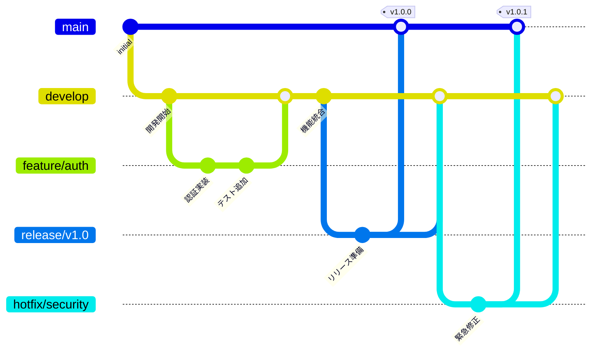
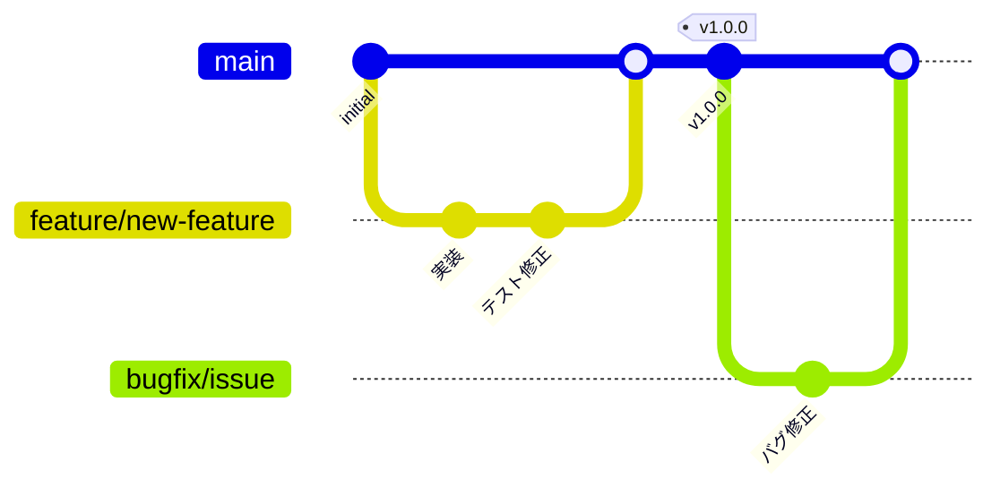

# ブランチ運用戦略

## Git FlowとFeature Branch Workflow ワークフロー

### 1. **Git Flow (未来の移行準備)**
Git Flowは、開発が進んでいく中で、複数人のチームでスムーズな作業分担と  
リリース管理を実現するためのブランチ戦略です。

将来的にチームが増えた場合、`Git Flow`に移行することでより効率的に開発を進めることができます。

Git Flowは以下のブランチを使用します

- **main**: 本番環境にデプロイされる、安定したコード。
- **develop**: 開発中のコード。新機能や改善が行われている状態。
- **feature/**: 新しい機能を開発するためのブランチ。
- **release/**: リリース準備のために使われるブランチ。バグ修正や最終調整を行う。
- **hotfix/**: 本番環境で問題が発生した際に、即時対応するためのブランチ。



### 2. **Feature Branch Workflow (現在のフロー)**
開発が1人または2人で行われている場合、`Feature Branch Workflow`はシンプルで効果的です。  
以下の手順に従って作業を進めます。



---

#### a. **main ブランチ**
- **main**は常に本番にリリース可能な状態を保ちます。
- 新機能の追加や修正が完了した段階でのみ、**main**にマージします。

#### b. **ブランチの作成**
- 新しい作業を開始する前に、**main**から作業用のブランチを作成します。
- 作業ブランチの命名規約は以下の通りです：
  - **`feature/`**: 新しい機能の開発。
  - **`bugfix/`**: バグ修正。
  - **`hotfix/`**: 本番環境での即時修正。
  - **`refactor/`**: 既存コードのリファクタリング。
  - **`chore/`**: テストや設定ファイルなど、プロジェクト管理に関連する作業。

命名規則：
- ブランチ名は一貫性を持たせ、**スラングや略語を避ける**。
- 機能や修正内容が明確に伝わるように、**簡潔で説明的な名前**を付けます。

例：
- `feature/user-authentication`
- `bugfix/login-issue`
- `hotfix/security-patch`
- `refactor/code-cleanup`
- `chore/update-dependencies`

```bash
git checkout main
git pull origin main  # main を最新状態に更新
git checkout -b feature/新しい機能名  # 作業用ブランチ作成
```

#### c. **作業中**
- 作業ブランチ内で変更を行い、**小まめにコミット**をします。
- コミットメッセージは意味のある単位で記載し、変更内容が明確になるようにします。

```bash
git add .
git commit -m "Add new health system"  # 例: 新しい健康システムの追加
git push origin feature/新しい機能名
```

#### d. **プルリクエスト (PR)**
- 作業が完了したら、**main**ブランチに対してプルリクエストを作成します。
- プルリクエストには作業内容、目的、変更点を簡潔に記載します。
- **コードレビュー**を依頼し、フィードバックをもらいます。

#### e. **コードレビューと修正**
- プルリクエストでレビューを受けた後、必要に応じて修正します。
- コードレビューを通してバグの早期発見やコード品質の向上を目指します。

#### f. **マージ**
- コードレビューが完了したら、**main**ブランチにマージします。
- **CI/CD**が導入されている場合、テストが成功したことを確認後、デプロイ可能状態になります。

```bash
git checkout main
git merge feature/新しい機能名
git push origin main
```

#### g. **リリース準備**
- リリース時には、**タグ**を付けて、バージョン番号を管理します。
- リリースタグ（例: `v1.0.0`）を付けて、リリースを管理します。

```bash
git tag -a v1.0.0 -m "Release version 1.0.0"
git push origin v1.0.0
```

#### h. **CI/CDとの連携**
- GitHub Actionsを使用して、プルリクエスト時に自動テストが実行されます
  - ユニットテストの実行
  - コードスタイルのチェック
  - コードカバレッジの計測
- テストが成功した場合のみマージを許可します
- mainブランチへのマージ後、以下の処理が自動的に行われます：
  - ビルド
  - テスト
  - リリースノート生成（タグ付け時）

---


### 3. **移行後の Git Flow 適用**
将来的に開発チームが増え、より複雑なリリース管理が必要になる場合、`Git Flow`に移行します。  
その場合、以下のステップで移行します。

- **main**: 本番環境用
- **develop**: 開発中のコード（新機能の統合）
- **feature/**: 新機能の開発
- **release/**: リリース準備
- **hotfix/**: 本番環境の問題修正

Git Flowを採用することで、リリース準備やバグ修正を効率的に管理できます。

---

### 4. コミットメッセージの規約

- タイプ: 変更内容の要約

タイプは以下のいずれかを使用
- feat: 新機能
- fix: バグ修正
- docs: ドキュメントのみの変更
- style: コードの意味に影響しない変更（フォーマット等）
- refactor: リファクタリング
- test: テストコードの追加・修正
- chore: ビルドプロセスやツール、ライブラリの変更

コミットメッセージの例
```
feat: 健康システムの実装

- NPCの健康状態を追跡する機能を実装
- 病気によるパフォーマンス低下の仕組みを追加
- 健康状態による消費行動の変化を実装
```

---

### 5. **まとめ**

- 現在は、**Feature Branch Workflow**を使用し、作業ブランチを切って進める。
- コードレビューを重視し、**main**にマージする前にテストを通し、リリース準備を整える。
- 将来的にチームが拡大する場合は、**Git Flow**に移行し、より複雑なリリース管理を実施。

このワークフローを採用することで、作業の効率化と品質の向上が期待できます。  
また、チームが増えた際にもスムーズに対応できる柔軟性を持たせています。