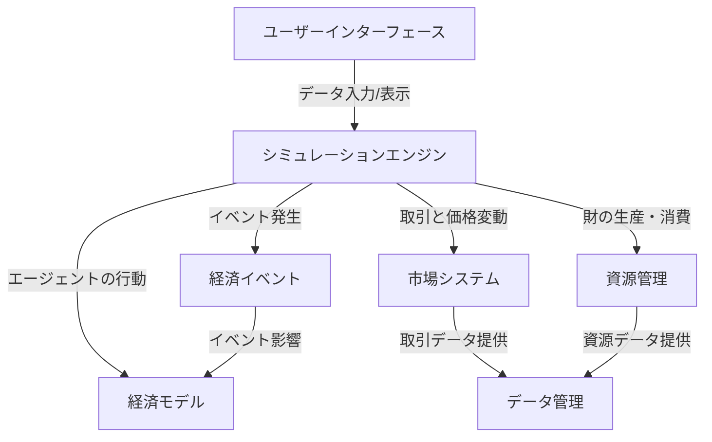
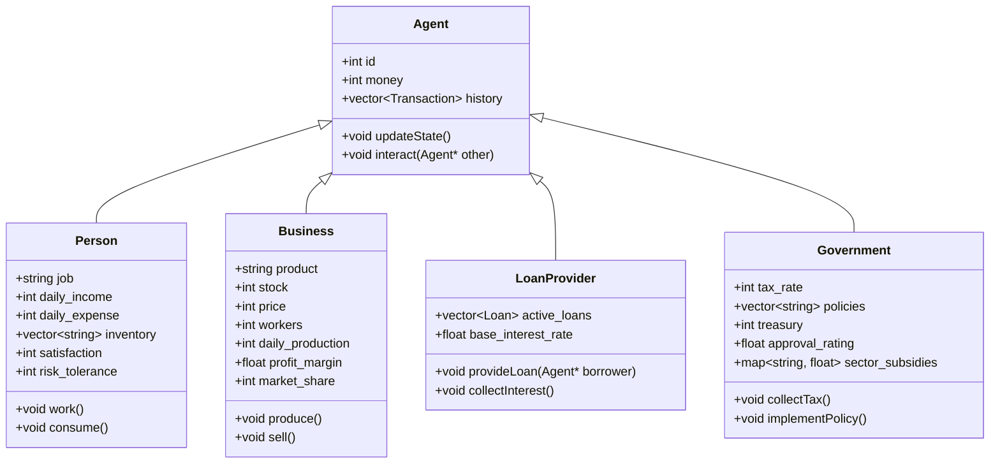
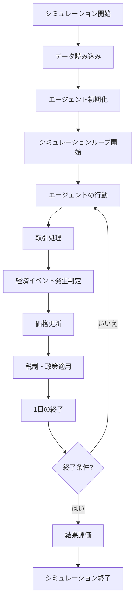
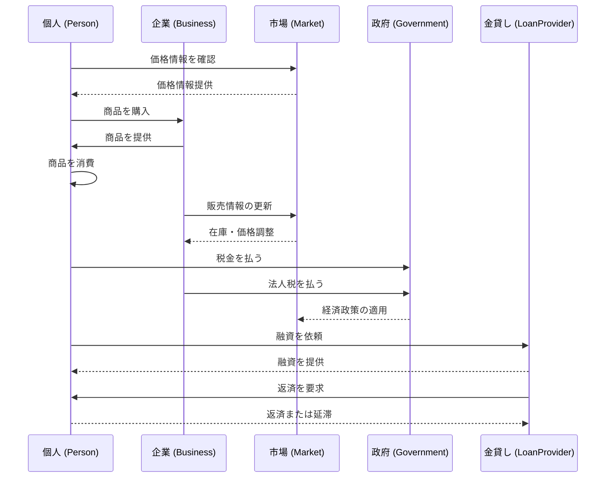

### `High_Level_Design.md`（基本設計書）

# High-Level Design (HLD)

## 1. システム概要
本システムは、中世近代を舞台にしたファンタジー世界の貨幣経済シミュレーションを実装する。  
フェーズ1では、基礎的な経済活動（生産・消費・取引）をシミュレーションし、エージェントが行動する仕組みを構築する。

---

## 2. システムアーキテクチャ
本システムは、C++ を用いたシミュレーションエンジンを中心に構成される。



- **シミュレーションエンジン**: エージェントの行動を管理し、経済モデルを実行する
- **経済モデル**: 需要と供給を元に市場の動きを決定
- **市場システム**: 価格変動や取引処理を担当
- **資源管理**: 財の生産・消費を管理
- **経済イベント**: 飢饉、戦争などのランダムイベントを管理
- **データ管理**: 取引ログやエージェントデータを管理（フェーズ1ではローカルメモリ）

---

## 3. エージェントの構造
各エージェントは、職業や経済行動に基づいた属性を持つ。



- **Person（個人）**: 労働、消費、貯蓄、交易を行う
- **Business（企業）**: 生産、雇用、販売、価格設定を行う
- **LoanProvider（金貸）**: 融資、利息徴収を行う
- **Government（政府）**: 税の徴収、価格制御、政策実施を行う

---

## 4. システムフロー

シミュレーションのメインループとエージェントの行動サイクルを示す。



---

## 5. データの流れ

エージェント間の相互作用と基本的な取引プロセスを示す。



### 5.1 データ構造

各エージェントや市場、交易システムのデータ構造を示す。

```cpp
struct Person {
    int id;
    int money;
    std::string job;
    int daily_income;
    int daily_expense;
    std::vector<std::string> inventory;
    int satisfaction;
    int risk_tolerance;
};

struct Business {
    int id;
    int money;
    std::string product;
    int stock;
    int price;
    int workers;
    int daily_production;
    float profit_margin;
    int market_share;
};

struct Market {
    std::map<std::string, int> stock;
    std::map<std::string, int> price;
    std::map<std::string, int> demand_history;
    std::map<std::string, int> supply_history;
    float price_volatility;
};

struct Loan {
    int lender_id;
    int borrower_id;
    int amount;
    float interest_rate;
    int days_remaining;
    int payment_schedule;
    bool defaulted;
};

struct Government {
    int id;
    int money;
    int tax_rate;
    std::vector<std::string> policies;
    int treasury;
    float approval_rating;
    std::map<std::string, float> sector_subsidies;
};
```

### 5.2 経済イベント

シミュレーション内では以下の経済イベントが発生します。

- **飢饉**: 食料価格の高騰と個人満足度の低下
- **戦争**: 武器需要の増加と労働力の減少
- **疫病**: 労働者数の減少と市場取引量の縮小
- **技術革新**: 特定産業の生産効率向上と価格下落

これらのイベントは一定確率で発生し、経済全体に影響を与えます。

### 5.3 価格メカニズム

市場では需要と供給のバランスにより価格が決定されます。

- 需要が供給を上回る場合、価格は上昇
- 供給が需要を上回る場合、価格は下落
- 価格変動は商品ごとの価格弾力性に影響される

基本的な価格調整は以下の考え方で行われます
```cpp
new_price = base_price * (1 + price_sensitivity * (demand - supply) / max(1, supply))
```

### 5.4 シミュレーション評価指数

経済シミュレーションの成果は以下の指標で評価します。

- **総生産量**: すべての企業の生産量合計
- **平均物価**: 基本生活必需品の価格平均
- **貧富差**: 最富裕層と最貧困層の資産格差
- **失業率**: 労働できない/しない個人の比率
- **市場活性度**: 日々の取引量の変化率

---

## 6. 開発フェーズと拡張計画

### 6.1 フェーズ1（基本経済活動）

- エージェント（個人・企業・金貸・政府）の基本機能実装
- 市場での取引システムの構築
- 基本的な価格変動メカニズムの実装
- テキストベースでのシミュレーション結果の出力

### 6.2 フェーズ2（地理的拡張）

- 物流と交易（村・都市間の経済移動）
- 人流の影響（人口移動による経済変動）
- 経済イベント（飢饉・戦争・疫病・技術革新）の実装
- 新たな職業・エージェントの追加

### 6.3 フェーズ3（システム高度化）

- より複雑な金融システムの実装
- 国際貿易システムの導入
- 人口動態変化のシミュレーション
- データの可視化と分析機能

### 6.4 フェーズ間の実装戦略

フェーズ1ではデータ中心のアプローチとしてstruct構造を採用し、  
フェーズ2以降で段階的にクラスベースの実装に移行します。  

これにより、初期段階での開発速度を確保しつつ、  
後続フェーズでのより柔軟な拡張を可能にします。

---

## 7. 参考資料

本設計の詳細については、以下を参照してください。

- 詳細設計書（LLD）
- 要件定義書
- テスト方針