# Low Level Design - 中世近代貨幣経済シミュレーション (フェーズ1)

## 1. システム構成図

本システムは中世から近代への移行期における貨幣経済をシミュレーションするものです。  
個人（NPC）、企業、金貸し、政府などのエージェントが相互に作用し、市場を介して経済活動を行います。

---

## 2. システム構成図
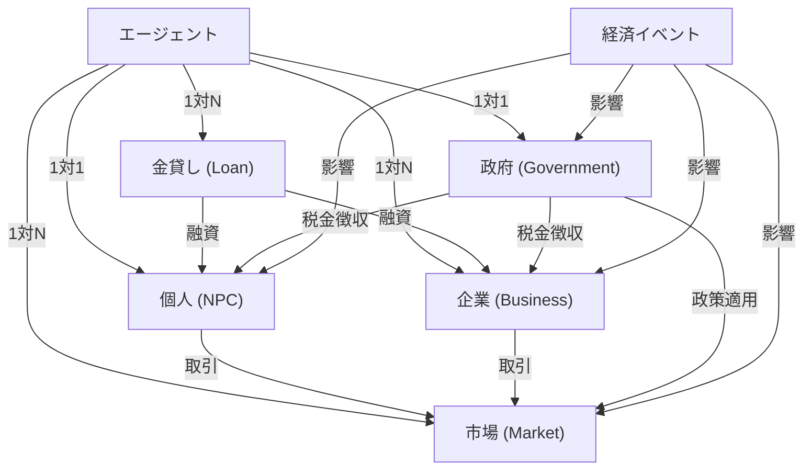

### 2.1 構成要素
- **エージェント**  
    - 個人（NPC）: 労働して収入を得、消費活動を行う一般市民
    - 企業（商人・工房）: 商品を生産・販売し利益を得る事業体
    - 金貸し（高利貸し）: 融資を提供し利子を得る金融主体
    - 政府（王国）: 税金を徴収し政策を実施する統治機関
- **市場**  
  - 商品と価格の管理: 需要と供給に基づいて価格が変動する交易の場
- **経済イベント**  
  - 価格変動、インフレ、戦争、飢饉など経済全体に影響を与える特殊事象

---

## 3. データ構造

エージェントはシミュレーション内での主体で、以下の情報を持ちます。

### 3.1 クラス階層

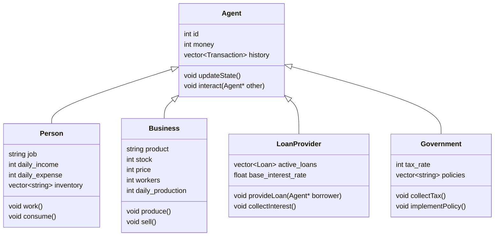

### 3.2 個人(NPC)

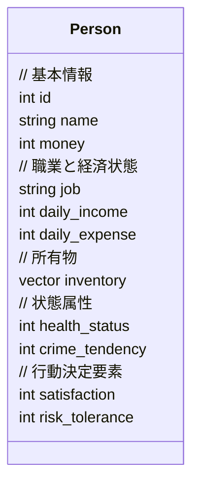

- **基本情報**: 個人の識別情報と資産
- **職業と経済状態**: 収入源と日々の経済活動
- **所有物**: 個人が所持する物品リスト
- **状態属性**: 健康や犯罪傾向などの行動に影響する要素
- **行動決定要素**: 経済的意思決定の判断基準となる心理的要素

### 3.3 企業 (Business)

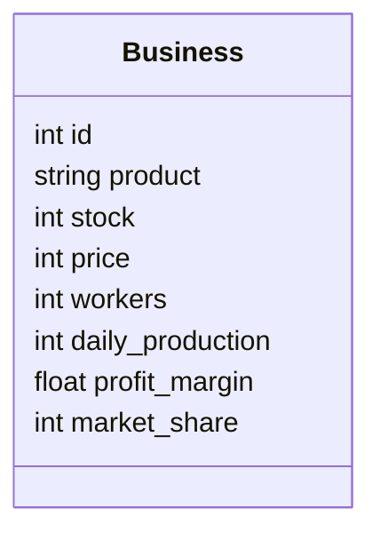

### 3.4 金貸し (Loan)

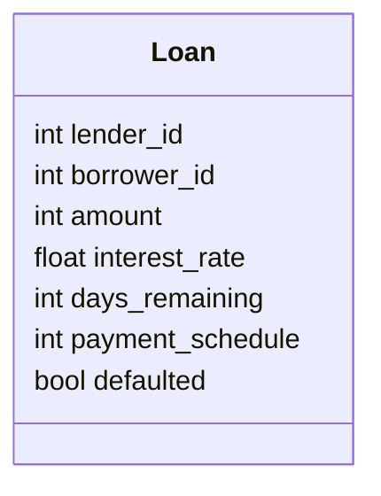

### 3.5 政府 (Government)

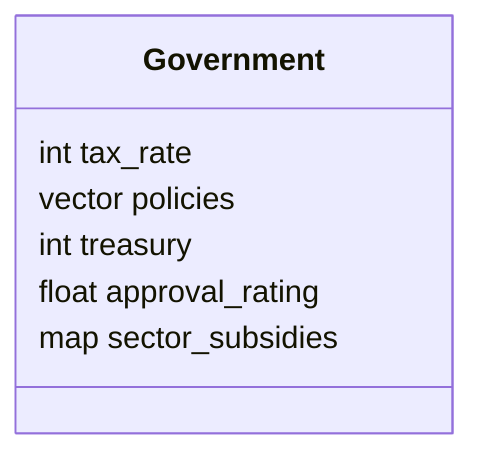

### 3.6 市場 (Market)

市場は商品の価格、在庫を管理します。

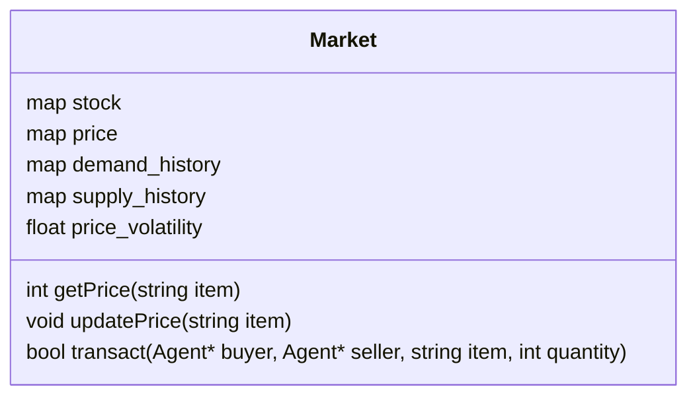

---

## 4.初期化プロセス

システム起動時には以下の初期化プロセスが実行されます

1. **設定パラメータの読み込み**
   - シミュレーションの基本設定（エージェント数、初期資本など）
   - 経済パラメータ（物価水準、税率など）
2. **エージェント生成**
   - 個人（NPC）: 職業、所持金、消費性向などをランダムに設定
   - 企業: 規模、生産品目、価格戦略などをランダムに設定
   - 金貸し: 融資可能額、利子率などを設定
   - 政府: 初期政策、税率を設定
3. **市場の初期化**
   - 商品ごとの初期価格を設定
   - 初期在庫量を設定
   - 経済イベントの設定
4. **発生確率テーブルの初期化**
   - イベント条件の設定

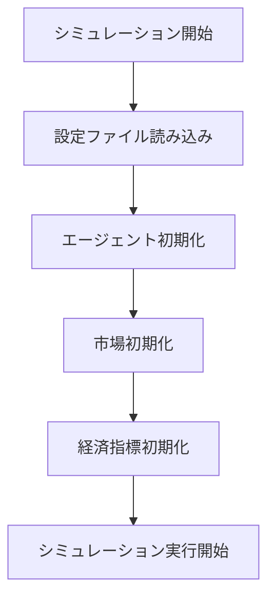


### 5. システムの振る舞い

エージェント間の基本的な相互作用パターンを示します。

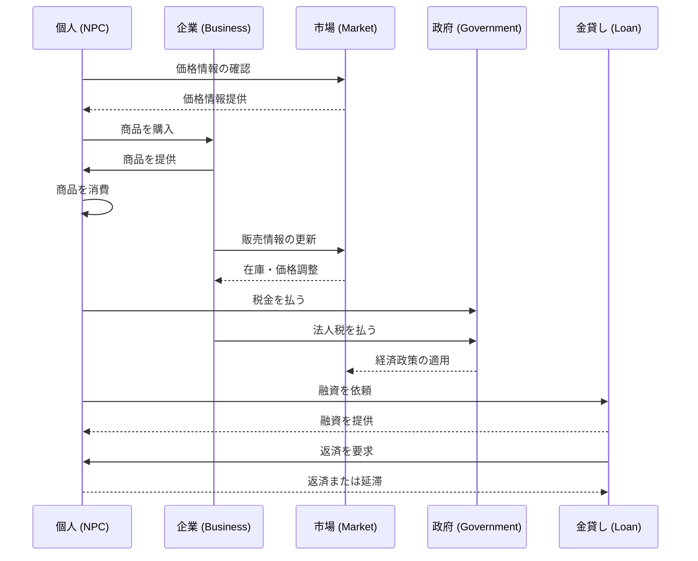

#### 5.1 複雑なケースの例：融資の延滞と回収

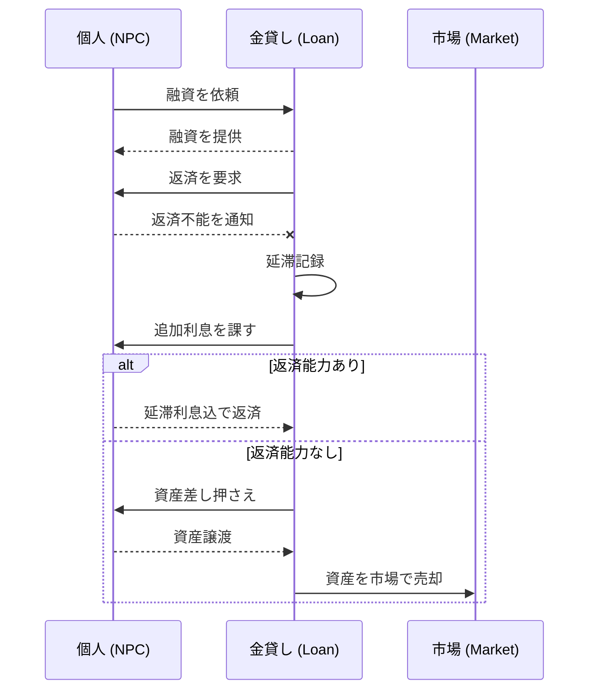

---

### 6. システム全体フロー

#### 6.1 システムの流れ
1. **開始時**  
   システムが起動すると、初期の経済状態が設定されます。  
   最初のエージェント（NPC、企業、金貸しなど）が生成され、基本的なデータが入力されます。

2. **1日の流れ**  
   各エージェントは1日の行動を開始します。
   - NPCは労働し、消費し、貯金します。
   - 企業は商品の生産と販売を行い、利益を得ます。
   - 金貸しは融資の提供と回収を行います。
   - 政府は税を徴収し、政策を適用します。

3. **経済イベントの発生**  
   一定の確率または条件によって、経済イベント（例：戦争、疫病、技術革新）が発生し、市場に影響を与えます。

4. **価格の更新**  
   需要と供給に基づいて、商品の価格が更新されます。  

   価格計算の基本式
   ```
   new_price = base_price * (1 + price_sensitivity * (demand - supply) / max(1, supply))
   ```
   - base_price: 前日の価格
   - price_sensitivity: 商品ごとの価格感応度（0.1〜0.5）
   - demand: 当日の総需要量
   - supply: 当日の総供給量

5. **シミュレーションの終了**  
   プレイヤーが希望するタイミングでシミュレーションを終了し、結果を評価します。

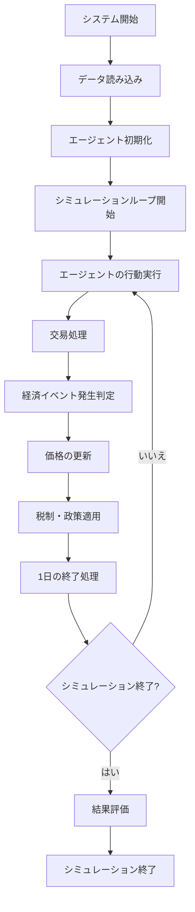

---

### 7.エージェントの行動

エージェントは種類ごとに異なる行動パターンを持ちます。

#### 7.1 行動概要
- **個人（NPC）**:
  - 労働を通じてお金を稼ぐ。
  - 商品を消費することで支出が発生する。
  - 商品の価格や自分の収入に応じて消費量を調整する。
  - 資金が不足すると金貸しに融資を依頼する。

- **企業（商人・工房）**:
  - 商品を生産し、販売することで利益を得る。
  - 価格設定により商品が売れるかどうかが変わる。
  - 需要に合わせて生産量を調整する。
  - 拡大投資やリスク回避のため資金を借り入れる。

- **金貸し** :
  - 借り手に対して融資を行い、利息を得る。
  - 市場状況に応じて利子率を調整する。
  - 返済期限を管理し、延滞者に対処する。
  - 融資のリスク評価を行い、融資の可否を決定する。

- **政府** :
  - 税金を徴収し、市場に政策（例：価格設定）を適用する。
  - 経済状況に応じて税率を調整する。
  - 特定の産業に補助金を提供する。
  - 経済イベントに対応する政策を実施する。

#### 7.2 行動フロー

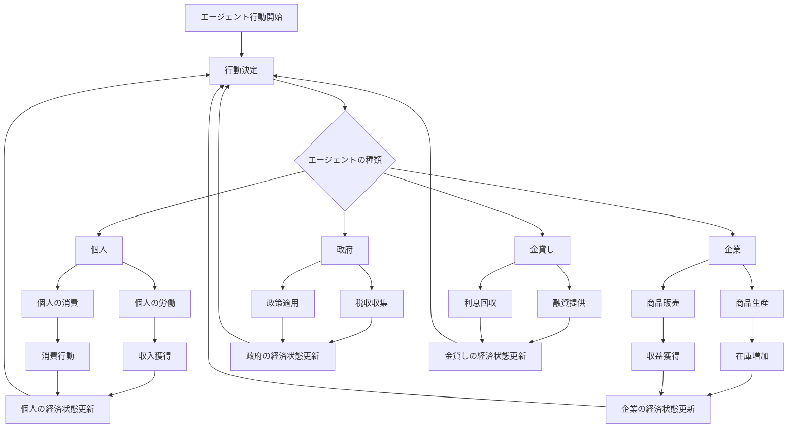

---

### 8. 経済イベント

経済イベントは価格やエージェントの行動に影響を与えます。  
イベントはランダムに発生しますが、特定の経済条件が満たされると発生確率が上昇します。

#### 8.1 イベント発生メカニズム

各経済イベントは以下の特性を持ちます

- **基本発生確率**: 毎日の基本発生確率（例：1%）
- **条件修飾子**: 特定条件下での確率増加（例：食料価格が通常の2倍以上で飢饉確率+5%）
- **持続期間**: イベントの効果が続く期間（例：3〜10日間）
- **影響範囲**: どのエージェントや市場セグメントに影響するか

#### 8.2 イベントリスト(追加予定)

イベントの数値は今後バランス調整を実施する

- **飢饉**: 食料の価格が急上昇。個人の消費に影響を与える。
  - 効果: 食料価格×2.5、個人満足度-20%、労働効率-10%
  - 条件: 前年の天候不順または輸入制限政策

- **戦争**: 武器や防具の需要が急増し、価格が上昇する。
  - 効果: 武器価格×3、労働力-20%、政府支出+50%
  - 条件: 外交関係の悪化または資源競争

- **疫病**: 労働者が減少し、商品の供給量が低下する。
  - 効果: 労働力-30%、医薬品需要×4、移動制限による交易量-50%
  - 条件: 人口密度の上昇、衛生状態の悪化

- **技術革新**: 生産性が向上し、特定商品の価格が下がる。
  - 効果: 対象産業の生産効率+40%、該当商品価格-30%
  - 条件: 研究投資の増加、特定のスキル保有者の集中

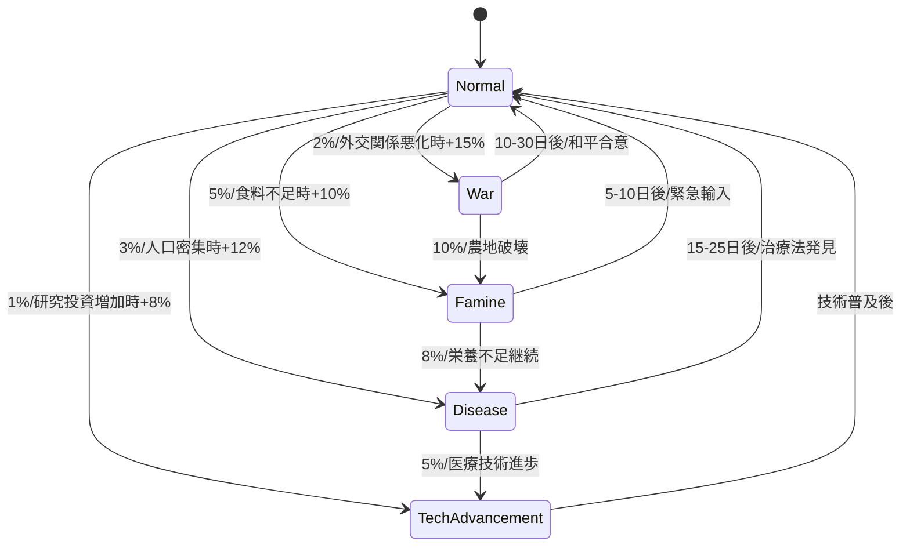

#### 8.3 イベント処理フロー

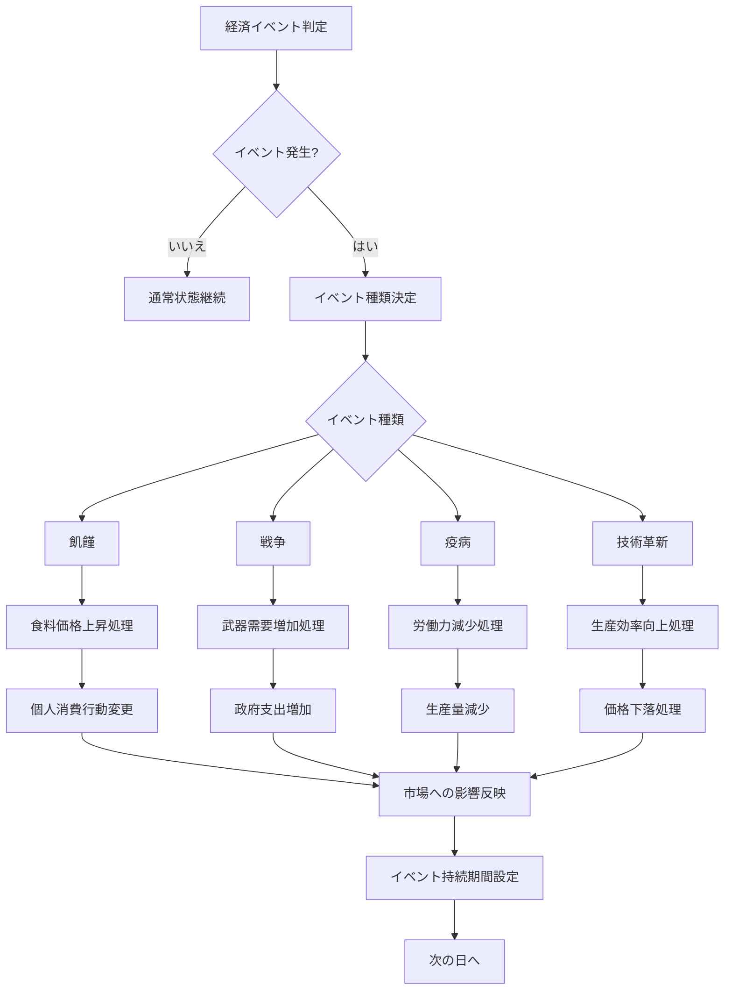

---

### 9. 取引の流れ（交易）

取引は市場を通じて行われ、価格メカニズムにより需要と供給のバランスが調整されます。

#### 9.1 価格決定メカニズム

価格は「需要と供給」に基づいて決定されます。価格変動アルゴリズムは以下の要素を考慮します

- **基準価格**: 過去の取引平均価格
- **需要量**: 直近の購入希望量の合計
- **供給量**: 市場での商品の利用可能量
- **価格弾力性**: 商品ごとの価格変動感度
- **取引量**: 実際に売買された商品量

例えば、飢饉時は食料の需要が高まり、供給が追いつかないため、価格が急上昇します。  
計算式は次のとおりです
```cpp
price_adjustment = base_price * min(3.0, max(0.5, (1.0 + (demand - supply) * elasticity / supply)))
new_price = base_price * 0.7 + price_adjustment * 0.3  // 急激な変動を抑制
```

#### 9.2 取引フロー

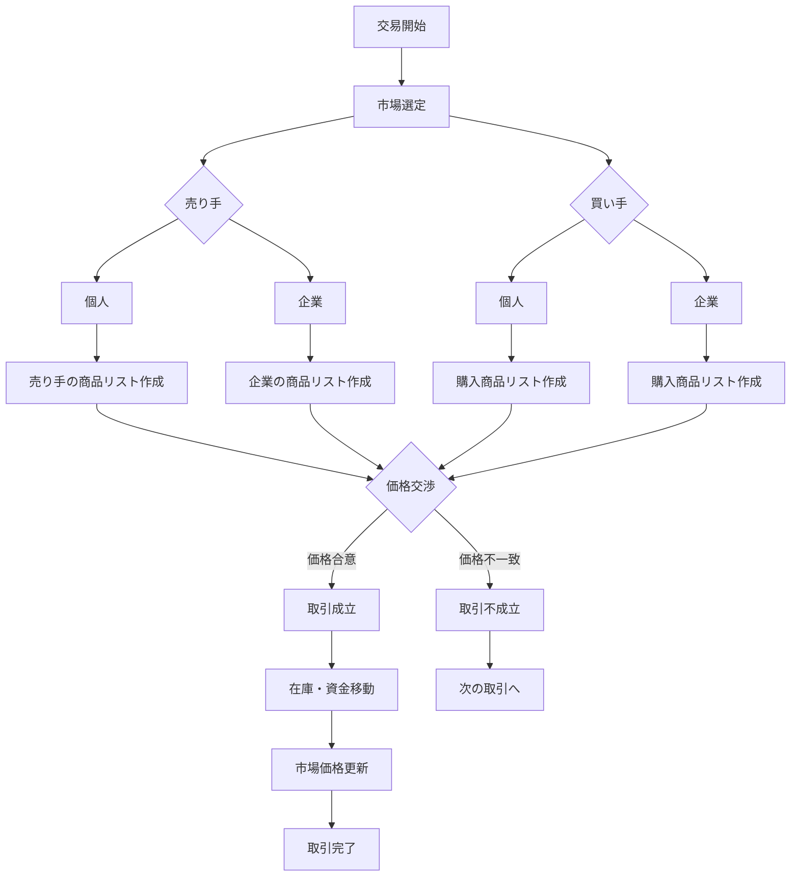

---

### 10. 税制・政策適用

政府は税金を徴収し、様々な経済政策を実施します。  
これにより市場や各エージェントの行動に影響を与えます。

#### 10.1 税制システム

- **個人所得税**: 個人の収入に対して課税（累進税制）
- **法人税**: 企業の利益に対して課税（一律税率）
- **取引税**: 商品取引に対して課税（商品種類により税率変動）

#### 10.2 政策の種類

- **価格規制**: 特定商品の最低/最高価格を設定
- **補助金**: 特定産業または商品生産に資金援助
- **輸入規制**: 特定商品の供給量制限
- **利子率操作**: 金貸しの基本利子率に影響

#### 10.3 政策適用フロー

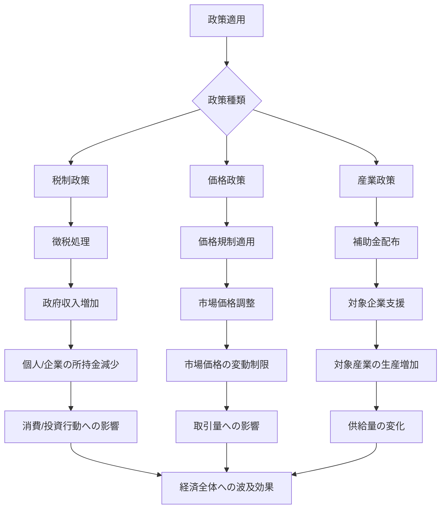

---

### 11. 個人データ・行動管理

個人（NPC）は経済システムの基本的な構成要素です。  
その行動は労働と消費を中心に構成されています。

#### 11.1. 労働・収入サイクル

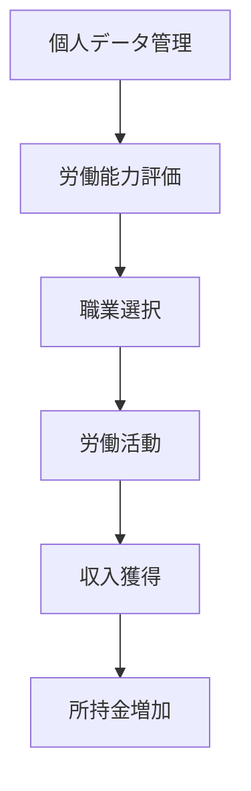

### 11.2 消費・支出サイクル

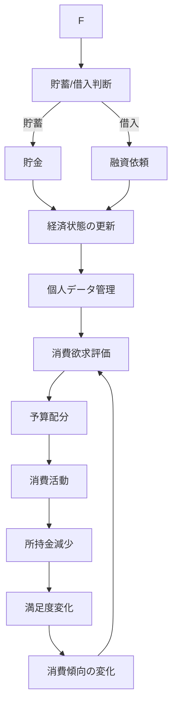

### 11.3 個人の意思決定アルゴリズム

個人の消費行動と労働選択は、以下の要素によって決定されます。

- **基本的欲求**: 食料、住居など必須消費財への需要
- **嗜好品需要**: 贅沢品や娯楽への需要（収入増加に伴い上昇）
- **リスク選好度**: 借入や投資への姿勢（個人ごとに異なる）
- **満足度**: 消費による効用と労働の負担のバランス

意思決定の数式例(消費分配)
```
食料支出 = 収入 * (0.3 + 0.1 * 飢餓度) * 食料価格係数
贅沢品支出 = max(0, 収入 - 必須支出) * 満足度不足係数 * (0.2 + 0.3 * リスク選好度)
```

---

### 12. 結果評価指標

シミュレーション結果を評価するために、以下の経済指標を計測します。

- **総生産量**: すべての企業の生産量合計
- **平均物価**: 基本生活必需品の価格平均
- **貧富差**: 最富裕層と最貧困層の資産格差
- **失業率**: 労働できない/しない個人の比率
- **市場活性度**: 日々の取引量の変化率
- **経済成長率**: 総生産量の変化率
- **通貨流通速度**: 取引に使用される通貨の回転率

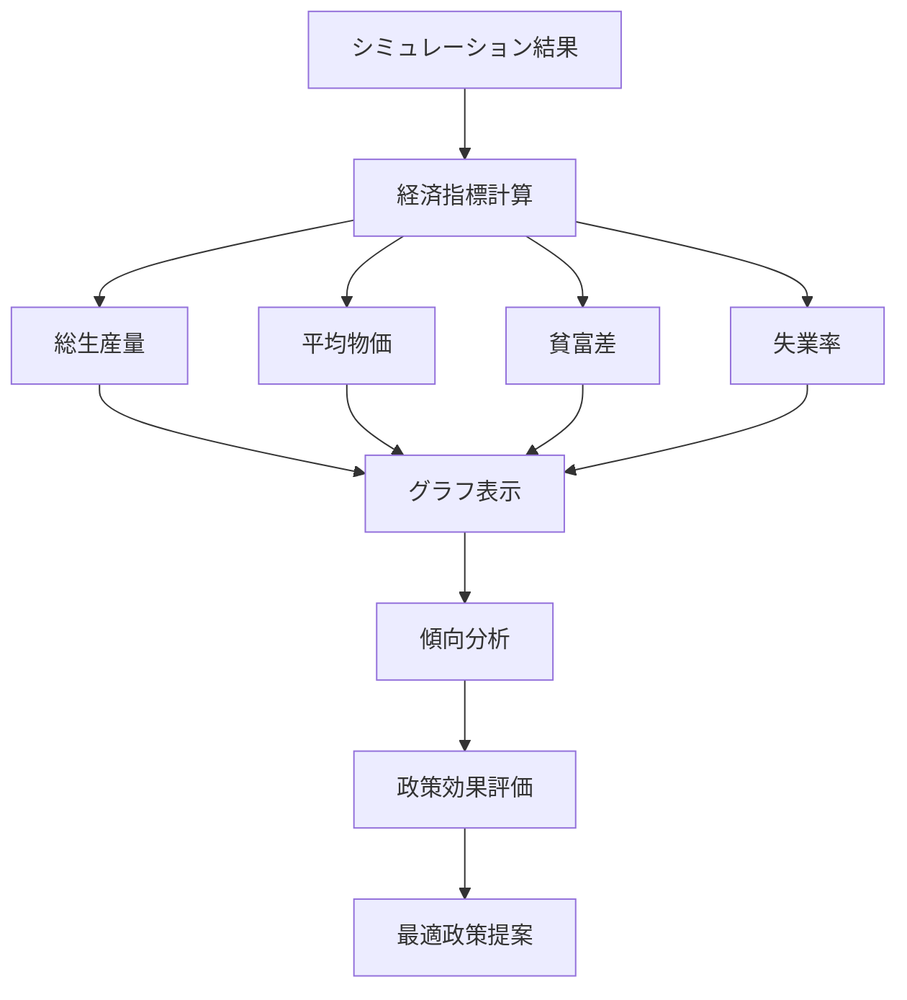

---

### 13. フェーズ間の移行計画

#### 13.1 structからクラスへの移行

フェーズ1で使用するstruct構造体は、フェーズ2以降で徐々にクラスに置き換えます。  
移行のステップは以下の通りです

1. カプセル化の導入: メンバ変数をprivateにし、アクセサメソッドを追加
2. 機能のメソッド化: データ操作ロジックをクラスメソッドとして実装
3. 継承関係の構築: Agent基底クラスと派生クラスの階層構造の実装
4. インターフェースの安定化: 公開APIの整備と内部実装の隠蔽

---

### 14. おわりに
このシミュレーションは中世から近代への移行期における経済システムの基本的な特性を再現し  
ファンタジー世界の物語やゲーム内における経済活動に対する理解や手助けをすることを目的としています。

エージェントの自律的な行動と相互作用により、以下のような現象の観察が可能になります。

- 価格メカニズムによる需給調整
- 貨幣経済における富の分配と蓄積
- 経済危機とその波及効果
- 政策介入の効果と限界
- ファンタジー世界における異人種を含む経済活動の観察


次のフェーズでは、より複雑な金融システム、国際貿易、人口動態の変化などを導入する予定です。