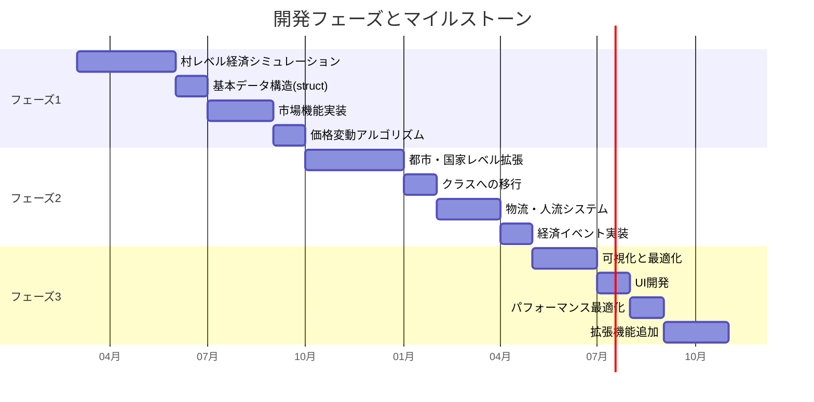

# **中世近代ファンタジー 貨幣経済シミュレーション - 要件定義書**

## **1. はじめに**
本書は「中世近代ファンタジー 貨幣経済シミュレーション」の要件定義を明確にし、システム設計・開発の基盤を作成することを目的とする。

---

## **2. システムの目的**
中世近代のファンタジー世界における貨幣流通をシミュレートし、インフレ・デフレの影響を観察する。
- ゲームや物語の世界で使える「経済システム」としても応用可能。
- シミュレーション内のアイテム価格や宿屋の価格などが変動し、NPCの生活にも影響を与える。

---

## **3. システムの範囲**
### **3.1 シミュレーション対象**
- 個人（NPC）
- 企業（商人・工房）
- 金貸（高利貸し）
- 政府（王国）

### **3.2 経済要素**
- 労働・消費・貯蓄・生産・雇用・融資・税制
- 価格変動（需要と供給のバランス、固定価格、ギルドや政府の最低価格設定）
- 交易（村・都市間の物流、人流）

### **3.3 イベント**
- 飢饉 → 食料価格高騰・一部NPCの餓死
- 戦争 → 武器・防具の価格上昇
- 疫病 → 労働者減少・市場規模縮小
- 新技術の発明 → 生産効率向上・特定商品の価格低下

---

## **4. システム要件**
### **4.1 機能要件**
#### **(1) エージェントの行動**
- **個人（NPC）**
  - 労働（職業ごとの収入を得る）
  - 消費（食料・日用品・贅沢品などを購入）
  - 貯蓄（所持金を保持）
  - 交易（移動しながら取引）

- **企業（商人・工房）**
  - 商品の生産
  - 労働者の雇用
  - 市場での販売
  - 価格の設定

- **金貸（高利貸し）**
  - 個人・企業に融資
  - 返済管理（利息を徴収）

- **政府（王国）**
  - 税の徴収
  - 専売制の運用（特定商品の固定価格）
  - 価格安定政策（最低価格や価格調整）

#### **(2) 市場システム**
- 需要と供給による価格変動
- 物流・人流による地域間価格の差異
- ギルドや国による価格制御

#### **(3) 交易システム**
- 村・都市間の物資の移動
- 人口・需要に応じた物流調整
- 交易商人の活動

#### **(4) 経済イベント**
- 飢饉・戦争・疫病・技術革新の影響
- 価格や人口への影響をシミュレーション

---

### **4.2 非機能要件**
#### **(1) シミュレーションの進行**
- 1日単位で経済活動を処理
- 時間経過とともにイベント発生

#### **(2) データ管理**
- **初期フェーズ:** テキストログによるデータ出力
- **後のフェーズ:** グラフィカルな可視化

#### **(3) システムの拡張性**
- 小規模シミュレーション（村レベル）から都市・国家規模へ拡張
- 追加エージェント（兵士・傭兵・神官・職人）の導入

---

## **5. システム構成**
### **5.1 データ構造**
#### **(1) 個人（NPC）**
```cpp
struct Person {
    int id;
    std::string name;
    int money;
    std::string job;
    int daily_income;
    int daily_expense;
    std::vector<std::string> inventory;
    int health_status; // 健康状態（0: 死亡, 1: 病気, 2: 健康）
    int crime_tendency; // 犯罪傾向（0: 低, 1: 中, 2: 高）
};
```

#### **(2) 企業**
```cpp
struct Business {
    int id;
    std::string product;
    int stock;
    int price;
    int workers;
    int daily_production;
};
```

#### **(3) 市場**
```cpp
struct Market {
    std::map<std::string, int> stock;
    std::map<std::string, int> price;
};
```

#### **(4) 交易システム**
```cpp
struct TradeRoute {
    int from_location_id;
    int to_location_id;
    std::map<std::string, int> goods;
    int travel_time;
};
```

---

## **6. フェーズごとの開発計画**



### **6.1 フェーズ1（村レベルの経済シミュレーション）**
- **目標:** 100人規模の村の経済を再現
- **実装内容:**
  - 基本的な市場機能（生産・労働・消費・貯蓄）
  - 価格変動の実装
  - テキストログでの結果出力

### **6.2 フェーズ2（都市・国家レベルへの拡張）**
- **目標:** 交易を含めた大規模経済のシミュレーション
- **実装内容:**
  - 物流・人流のシミュレーション
  - 企業・金貸の影響を拡張
  - イベントの追加（飢饉・戦争・疫病）

### **6.3 フェーズ3（可視化と最適化）**
- **目標:** シミュレーションの視覚的確認とパフォーマンス改善
- **実装内容:**
  - 経済データのグラフ化
  - システムの最適化（並列処理など）

---

## **7. 想定される課題と対策**
### **(1) 計算負荷の増大**
- **課題:** NPCが増えると計算量が膨大に
- **対策:** 経済の影響が少ないNPCをグループ化し、詳細な計算を省略

### **(2) 価格の急激な変動**
- **課題:** 需要・供給の変動が急激すぎる可能性
- **対策:** 最低価格や価格変動の上限を設ける

---

## **8. 次のアクション**
1. **フェーズ1の実装開始**
   - 小規模経済のシミュレーションを作成
   - テキストログでの価格・収入・消費データの出力
2. **データ分析と価格変動の調整**
   - テストデータを基にバランス調整

---

## **9. まとめ**
本シミュレーションは、中世近代の経済を再現し、NPCの生活や市場価格の変動を観察することを目的とする。  
**村から都市、そして国家レベルへ拡張可能なシステム** を構築し、最終的に **視覚的に経済の流れを把握** できる形にする。  

---